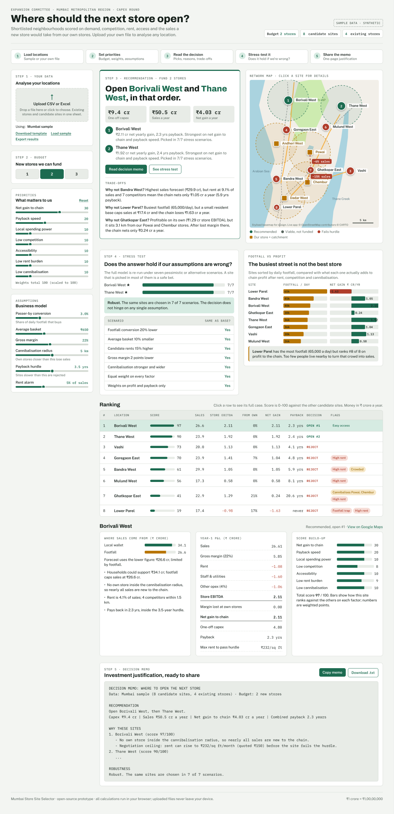

# Mumbai Store Site Selector

**Where should the next store open?** A browser-based prototype that compares shortlisted retail locations and recommends which to fund, with reasons and trade-offs. Ships with Mumbai sample data in Indian rupees; upload your own CSV or Excel file to analyse any location in India.



Figma design file: https://www.figma.com/design/IXpm1JFOAhfVPGI8lyFmhS

## The seven tabs
| Tab | What it answers |
|---|---|
| 1 Recommendation | Which sites to open, at what cost and return; map, ranked cards (Open / Reserve / Avoid), trade-offs and the full case for any site |
| 2 Upload & analyse | Upload CSV/Excel, add a single site, edit every input |
| 3 Compare locations | All sites side by side, return-against-risk chart, footfall-vs-profit chart |
| 4 Stress test | Does the answer survive 7 pessimistic or alternative scenarios? |
| 5 Assumptions | Register of every assumption: value, reason, basis, and a live test of whether the picks change if it is worse; data provenance; calibration |
| 6 How it works | The five-step method, formulas, key limitation, business value |
| 7 Decision memo | One-page justification to copy or download |

## What it does
- Estimates yearly sales two ways: **local wallet** (households × income × category spend × our share vs competitors) and **footfall** (passers-by × conversion × basket). It uses the lower one, so busy commuter streets don't look better than they are.
- **Calibrates** against your existing stores' actual sales.
- Subtracts **cannibalisation**: margin lost at your own nearby stores.
- Applies a **payback hurdle**, ranks survivors on a weighted score, and picks the funded set one at a time so new stores don't eat each other.
- Explains every pick and every "why not" in plain language.
- **Real map** (OpenStreetMap / CARTO tiles via Leaflet): store catchments, ranked pins, red links showing which own store a site would take sales from, popups with the numbers, and **click anywhere on the map to test that spot**.
- **Stress test**: re-runs the whole decision under 7 scenarios (lower conversion, smaller basket, higher rent, lower margin, stronger cannibalisation, different priorities) and says whether the answer holds.
- **Footfall vs profit** chart that shows why the busiest street is not the best store.
- **Negotiation ceiling**: the highest rent at which each site still meets the payback hurdle.
- **Decision memo**: a one-page justification you can copy or download.
- **Upload** CSV/XLSX, **quick-add** a single location, **edit** any input, **export** the ranking to CSV.

Everything runs in the browser. Uploaded files never leave the user's device. No server, no build step.

## Folder structure
```
index.html            page + SEO tags
assets/styles.css     design tokens and layout
assets/model.js       pure calculation engine (testable in Node)
assets/app.js         UI, upload, map, rendering
data/template.csv     blank upload template
data/mumbai-sample.csv
design/               screenshots + design-tokens.json for Figma
robots.txt, sitemap.xml, .nojekyll, LICENSE
```

## How to demo it (90 seconds)
1. **Problem** – "We can fund two stores. Busy streets and rich areas look attractive, but rent, competition and stealing sales from our own stores change the answer."
2. **Decision** – point at the recommendation and the map: Borivali West and Thane West, ₹9.4 cr capex, ₹4 cr a year net gain, about 2.3-year payback.
3. **Trade-offs** – click Lower Parel (busiest, loses money) and Ghatkopar East (red links to Powai and Chembur).
4. **Robustness** – stress test: same answer in 7 of 7 scenarios. Move a slider live to show it updating.
5. **Any location** – click an empty spot on the map → "Analyse this spot", or upload a CSV.
6. **Value and limitation** – consistent, defensible capex decisions in minutes; catchments are straight-line circles, so validate with travel-time data.

## Upload format
One sheet, one row per location. Header names are matched loosely (e.g. `latitude` works for `lat`).

| column | meaning | example |
|---|---|---|
| name | location name (unique) | Borivali West |
| type | `existing` or `candidate` | candidate |
| lat, lng | coordinates (right-click in Google Maps to copy) | 19.2307, 72.8567 |
| population_lakh | people in the ~2 km catchment, in lakh | 4.0 |
| income_k_month | median household income, ₹ thousand / month | 120 |
| footfall_day | people passing the site per day | 40000 |
| competitors | competing supermarkets within 1.5 km | 4 |
| rent_sqft_month | quoted rent, ₹ / sq ft / month | 220 |
| access_score | 0–10 (rail/metro, bus, parking, road) | 9 |
| actual_sales_cr | existing stores only: last year's sales, ₹ crore | 30.4 |

Population given as people (e.g. 400000) or income as ₹/month (e.g. 120000) is converted automatically.

## Run locally
Open `index.html` in a browser, or serve the folder:
```bash
python3 -m http.server 8000   # then open http://localhost:8000
```

## Publish on GitHub Pages (free)
1. Create a new public repository on GitHub, e.g. `store-site-selector`.
2. Upload all files in this folder (keep the folder structure), or:
   ```bash
   git init
   git add .
   git commit -m "Mumbai store site selector"
   git branch -M main
   git remote add origin https://github.com/USERNAME/store-site-selector.git
   git push -u origin main
   ```
3. In the repo: **Settings → Pages → Build and deployment → Source: Deploy from a branch → Branch: `main` / `(root)` → Save**.
4. After about a minute the site is live at `https://USERNAME.github.io/store-site-selector/`.
5. Replace `USERNAME.github.io/REPO` in `index.html`, `robots.txt` and `sitemap.xml` with your real URL and push again.

## Get it on Google
1. Go to [Google Search Console](https://search.google.com/search-console) → **Add property → URL prefix** → paste your GitHub Pages URL.
2. Choose **HTML tag** verification, copy the `content="..."` code, paste it into the commented `google-site-verification` line in `index.html`, uncomment it, push, then click **Verify**.
3. In Search Console open **Sitemaps** and submit `sitemap.xml`.
4. Use **URL Inspection → Request indexing** on the home page. Google usually lists new sites within a few days to a few weeks.

## Assumptions (sample data)
Neighbourhood figures are synthetic; coordinates are real. Store format 6,000 sq ft; staff & utilities ₹1.6 crore/yr; other opex 4% of sales; fit-out ₹4,000/sq ft; opening stock ₹1.5 crore; 10 months' rent deposit. Change fixed values in `assets/model.js` (`FIXED`), and slider defaults in `DEFAULTS`.

## Key limitation
Catchments are straight-line circles. Mumbai shoppers follow rail lines, creeks and flyovers, so validate shortlisted sites with travel-time catchments and loyalty-card data before signing a lease.

## License
MIT
